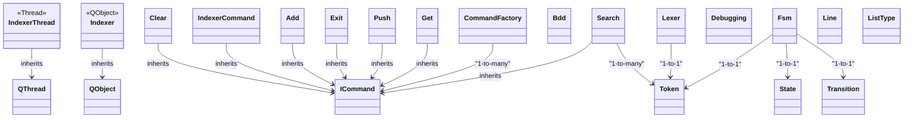

## Projet de recherche d'indexation de fichiers

### Description :
Ce projet est une application de recherche d'indexation de fichiers qui permet de rechercher des fichiers dans un répertoire donné en fonction de critères spécifiques. L'application indexe les fichiers dans un répertoire donné et permet de rechercher des fichiers en fonction de critères tels que l'extension, la date de création, la date de modification, la taille, etc.

### Fonctionnalités :
1. **Indexation des fichiers** :
    - L'application indexe les fichiers dans un répertoire donné.
    - Les fichiers sont indexés en fonction de leur nom, de leur chemin, de leur extension, de leur date de création, de leur date de modification et de leur taille.
2. **Recherche de fichiers** :
    - L'application permet de rechercher des fichiers en fonction de critères spécifiques.
    - Les critères de recherche incluent l'extension, la date de création, la date de modification, la taille, etc.
3. **Interface en ligne de commande** :
    - L'application est basée sur une interface en ligne de commande.

### Technologies utilisées :
1. **C++** :
    - Le projet est implémenté en C++ sur une base de QT.
2. **QT** :
    - Le projet est basé sur la bibliothèque QT.
3. **Git** :
    - Le projet est versionné avec Git.

### Installation et exécution :
1. **Cloner le dépôt** :
    ```bash
    git clone
    ```
2. **Compiler le projet** :
    ```bash
    make
    ```
3. **Exécuter l'application** :
    ```bash
    ./app
    ```
4. **Nettoyer les fichiers générés** :
    ```bash
    make clean
    ```

### Classes :


### Explications :
1. **Relations d'héritage** :
    - Les flèches pleines indiquent les relations d'héritage avec l'étiquette `inherits`.
2. **Relations d'association** :
    - Les étiquettes "1-to-1" ou "1-to-many" expliquent le type de relation.
    - `-->` indique une relation unidirectionnelle.

### Diagramme d'état :


### Explications :
1. **États initiaux et finaux** :
    - L'état initial est marqué par `[ * ]` et se dirige vers `UNKNOWN`.
    - L'état final est marqué par `[ * ]` à la fin de transitions pertinentes comme `FINISH`.

2. **Transitions conditionnelles** :
    - Les transitions sont déclenchées par des conditions sur le type ou la valeur des tokens (par exemple, `COMMAND == "SEARCH"` ou `OPTION == "EXT"`).

3. **États intermédiaires** :
    - Chaque état exécute une logique particulière, et les transitions sont définies pour passer d'un état à l'autre selon les tokens analysés.

4. **Erreurs** :
    - L'état `ERROR` représente les cas où une transition invalide ou une erreur d'exécution est rencontrée.


### Auteurs :
- Enzo Parriel
- Louis Sasse
