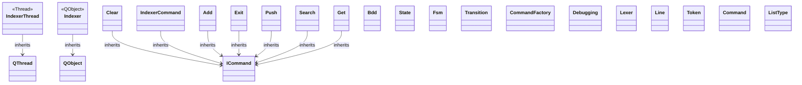

```mermaid
classDiagram
    class IndexerThread {
        <<Thread>>
    }
    class Indexer {
        <<QObject>>
    }
    class ICommand {
    }
    class Clear {
    }
    class IndexerCommand {
    }
    class Add {
    }
    class Exit {
    }
    class Push {
    }
    class Search {
    }
    class Get {
    }
    class Bdd {
    }
    class State {
    }
    class Fsm {
    }
    class Transition {
    }
    class CommandFactory {
    }
    class Debugging {
    }
    class Lexer {
    }
    class Line {
    }
    class Token {
    }
    class Command {
    }
    class ListType {
    }

    IndexerThread --> QThread : inherits
    Indexer --> QObject : inherits
    Clear --> ICommand : inherits
    IndexerCommand --> ICommand : inherits
    Add --> ICommand : inherits
    Exit --> ICommand : inherits
    Push --> ICommand : inherits
    Search --> ICommand : inherits
    Get --> ICommand : inherits
```